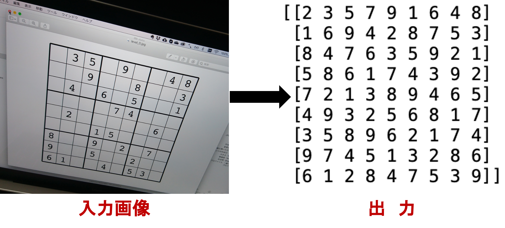

# 数独ソルバー
___

## 概要

- 写真で撮影した数独の本を画像認識することにより、自動的に数独を解いて結果を出力する数独ソルバー。

## 手順
### 1_preprocess.ipynb
（ipynbが開けない場合は[こちら](https://nbviewer.jupyter.org/github/astaka-pe/sudokusolver/blob/master/1_preprocess.ipynb)）

- 画像読み込み
- エッジ検出
- 9x9画像分割

### 2_solve.ipynb
（ipynbが開けない場合は[こちら](https://nbviewer.jupyter.org/github/astaka-pe/sudokusolver/blob/master/2_solve.ipynb)）

- Tesseractを用いた数字検出
- 数独を解く